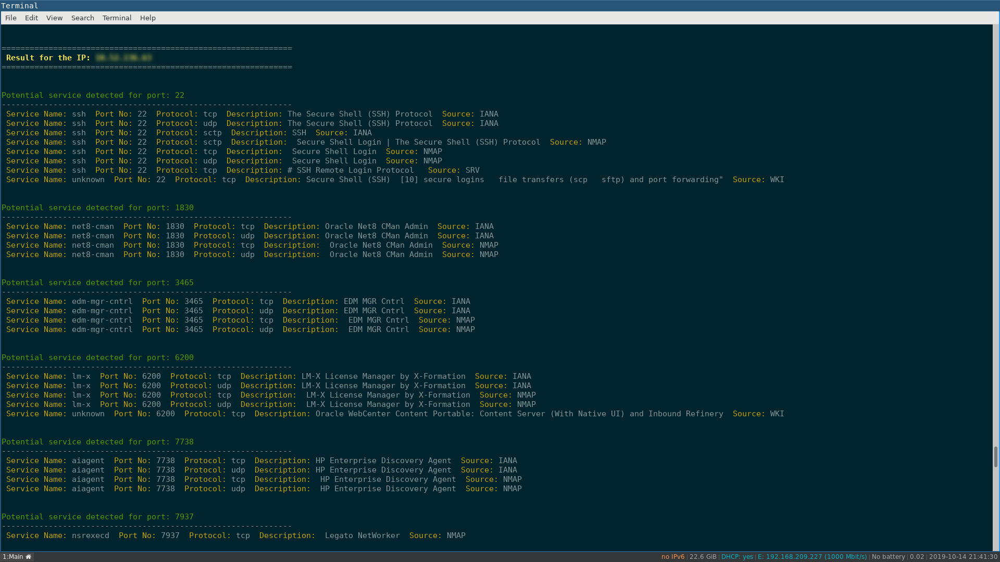

.. raw:: html

   <h1 align="center">

.. raw:: html

    
   KILLER PROJECT
    

.. image:: https://img.shields.io/github/last-commit/TH3xACE/OFFPORT_KILLER?style=plastic
   :target: https://github.com/TH3xACE/SUDO_KILLER
   :alt: Last Commit
	
.. raw:: html

   </h1>

#Manual Port Scanning #Enumerate Potential Service

.. contents:: 
    :local:
    :depth: 1

=============
INTRO
=============

This tool aims at automating the identification of potential service running behind ports identified manually. 
The tool is useful when nmap or any scanning tool is not available and in the situation during which you did 
a manual port scanning and then want to identify the services running behind the identified ports.

=============
Usage
=============

Example
--------------------------
 .. code-block:: console
 
 	./OFFPORT_KILLER.sh -i inputfile.txt -r report.txt -e /tmp/

Arguments
--------------------------
* **-i : input file (format IP:PORT)**
* **-r : report name (save the output)**
* **-h : help**

Steps
--------------------------
  
+ Step 1: Peform a manual port scanning (using nc, tcpdump or whatever)
+ Step 2: Create a file with format IP:PORT (where IP is the target IP address and PORT is a port identified).    
+ Step 3: Run the tool with the file created using the argument -i                                           

Note: Create an entry for each port, several IP can be input in the file.

inputfile.txt
-------------------------
 .. code-block:: console
192.168.1.12:1830
192.168.1.12:7738
192.168.1.14:22
192.168.1.14:7738
192.168.1.15:3465

=============
Output
=============

=============
Disclaimer
=============
This script is for Educational purpose ONLY. Do not use it without permission. The usual disclaimer applies, especially the fact that me (TH3xACE) is not liable for any damages 
caused by direct or indirect use of the information or functionality provided by these programs. The author or any Internet provider bears NO responsibility for content or misuse 
of these programs or any derivatives thereof. By using these programs you accept the fact that any damage (dataloss, system crash, system compromise, etc.) caused by the use of 
the script is not my responsibility.

